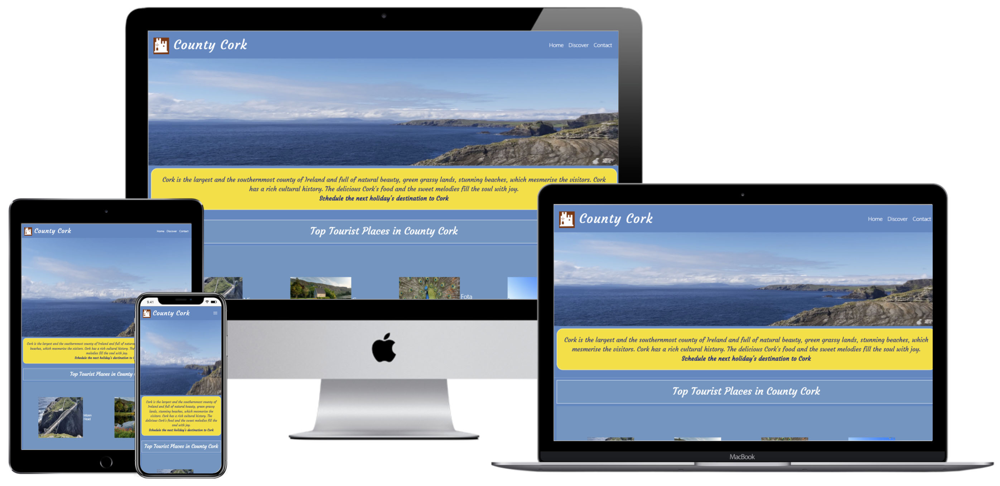
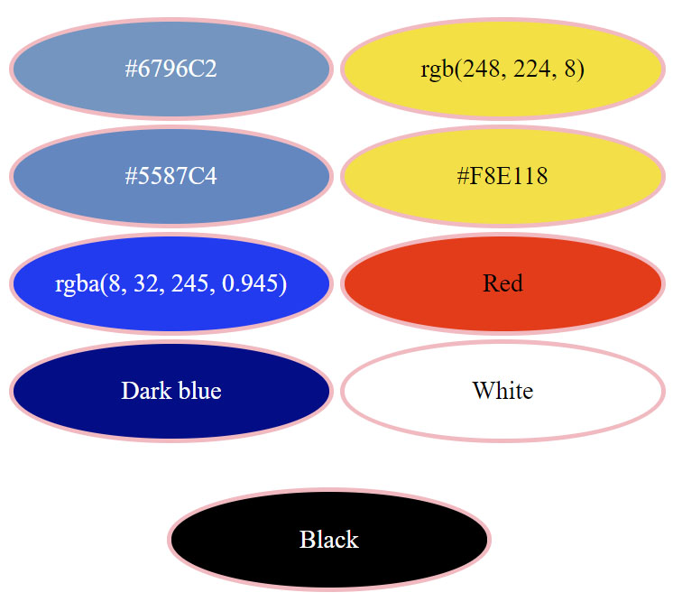
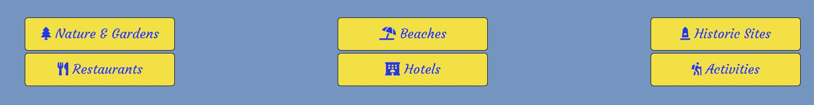
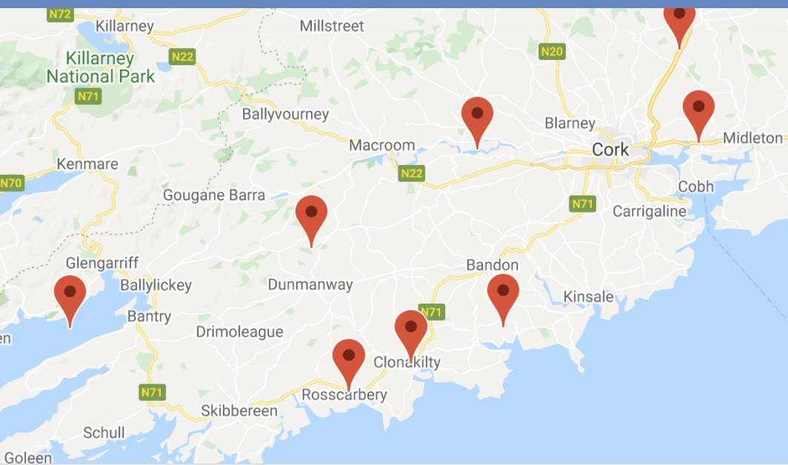
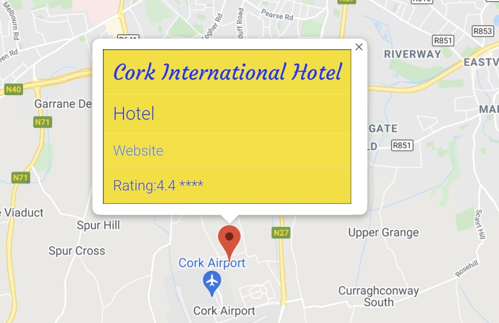
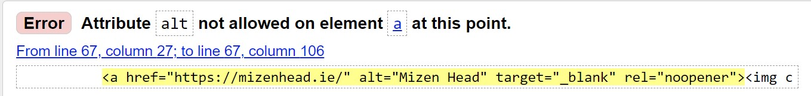
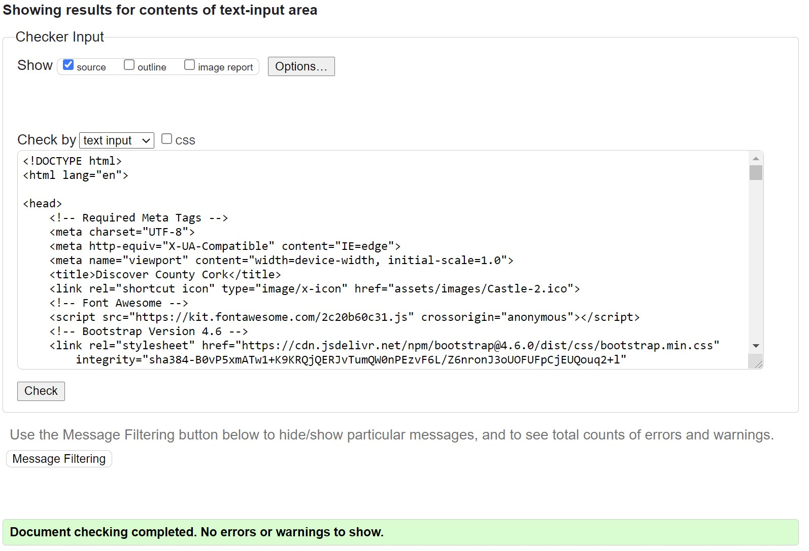
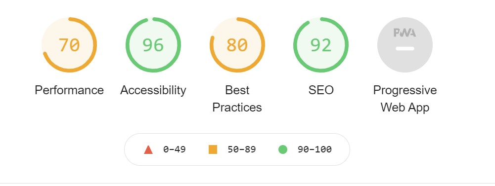

Welcome To My Second Milestone project

# [Discover County Cork](https://mqsaud.github.io/Milestone-2/)

## USER EXPERIENCE
This website is designed to attract the tourist to county Cork.

## Website Goal.
1- Promote tourism to county Cork.  
2- Provide the informations about the tourist destinations within county Cork.  
3- Provide the informations about the quality restaurants and hotels.  
4- Tourist can send a message to website management team if they need to know more about the county Cork.  

## Visitor Attractions
Upon landing on page,  
1- Visitor can nevigate to the all pages of the website easily.  
2- Easily get informations about the tourist destinations.  
3- Easily get informations about restaurants and hotels.  
4- Easily contact the website management if they want to get some information.  

### User Stories
#### First Time Visitor Goal  
a -  As a first time visitor, I want to know what tourist information is available.   
b - I want to be able to navigate around the different pages easily.  
c - I want  able to get information about different tourist destinations.  
d - I want to find the social media links to find out the reputation and fan following of the website.  

#### Returning Visitor Goal  
a - As a returning visitor, I want to get more details about tourist destinations like location on map.  
b - I want to get informations about social media rating and website address for tourist destinations.

#### Frequent User Goal
a- As a frequent visitor, I want to know is there any hotel offer by visiting the hotel's website marked on the map.  
b- I want to know about the more detailed infomationabout toursit destinations marked on map.  

  

## Designe
#### Color Scheme
Following colors are used.  
  

#### Typography  
Following fonts are used.    
1-System default Sanns-serif font.    
2-Courgette for logo and introductory paragraph.    
3-System default cursive as the fallback font for Courgette font.  

#### Imagery  
A picture is worth than  thousand words. The website is furnished with many beautiful images specialy the hero image. The credits are given below each image which I download from internet,in code files.  

#### Video
A beautiful video with sweet malodies in integrated in landing page. The credit is given below the video in index.html page.  

#### Wirefarme
The concept of website was frist implemented in wireframe file.  
Balsamiq Wireframe software was uased to create wireframe file and then the file saved as pdf file.  
To view wirefarme please click [here](https://github.com/mqsaud/Milestone-2/blob/master/assets/Milestone-2-project-wireframe.pdf)  

  

## Technology used

##### Languages
1- HTML5  
2- CSS3  
3- JavaScript  

#### Frameworks, Libraries and Programs 

1. [Bootstrap Ver 4.6:](https://getbootstrap.com/docs/4.6/getting-started/introduction/)
    - Bootstrap was used to make the website responsive and stylish.  
1.  [JQuery Ver 3.3.1 ](https://code.jquery.com/jquery-3.3.1.slim.min.js)
    - JQuery was used to target DOM elements.      
1. [Balsamiq Ver 4.2.4:](https://balsamiq.com/)
    - Balsamiq software was used to create the wirefarme images .
1. [Google Fonts:](https://fonts.google.com/)
    - From Google fonts Cario font was imported in style.css file.
1. [Font Awesome:](https://fontawesome.com/)
    - Font Awesome was used to download social media icons.
1. [Git](https://gitpod.io/)
    - Gitpod was used for version control by using the Gitpod terminal to commit to Git and Push to GitHub.
1. [GitHub:](https://github.com/)
    - GitHub plateform is used to store the project.
1. [Photoshop:](https://www.adobe.com/ie/products/photoshop.html)
    - Adobe Photoshop was used to resize and edit the images for the website.  

## Test and vaidation
#### 5. Testing
Two methods were adopted to test this project.  
a. Manual Testing,   
b. Third-Party Test services, 

#### Manual Testing
In manual testing each page and every button was tested for proper functionality.

Upon loading the landing page, the top Nav-bar was tsted as following,
|Action|Result|
|-------------|--------------|
|Pressed Home button|Home page reloaded|
|Pressed Discover button|Discover page loaded|
|Pressed Contact button|Contact page loaded|
|||  

The above procedure was repeated with the Nav-bar of every page and got same result.

On Home page, by pressing the image below the headind "Top Tourist Places in County Cork" the following results was achived.

|Action|Result|
|------|------|
|Pressed Mizen Head image|"https://mizenhead.ie" page opened in a new tab|
|Pressed Gougane Barra image|"http://www.gouganebarra.com" page opened in a new tab|
|Pressed Fota Wildlife Park image|"https://www.fotawildlife.ie" page opened in a new tab|
|Pressed Blarney Castle image|"https://www.blarneycastle.ie" page opened in a new tab 
|||  

On Home page there is a video player, upon pressing its play button a vides starts to play. Video credit is given in index.html file.

The buttons on the footer of every page was tested as following.
|Action|Results|
|------|-------|
|Pressed Home button|Home page reloaded|
|Pressed Contact button|Contact page loaded|
|pressed facebook icon|"https://www.facebook.com" page loaded in a new tab|
|Pressed Twitter icon|"https://twitter.com" page loaded in a new tab|
|Pressed Instagram icon|"https://www.instagram.com" page loaded in a new tab|
|Pressed Youtube icon|"https://www.youtube.com" page loaded in anew tab|
|||

On Discover page 6 different categories are provided.
On clicking each category markers are droped on map. 
When a marker is clicked an info-window appears containing onformation abou that marker. Most of the info-windows are provided with website links and using these links the visitor can get some benifits, like hotel booking, restaurant booking atc..  
Each marker, each info-window and web link is tested.

#### Third-Party-Test-Services 
All html files are validated with no errors by W3C vaidation service.  

During testing some files has failed validation test.  
After resolving the cause of validation failure, all files passed the validation test.  
CSS file validated with no errors by using Jig saw validation service.  

### Testing User Stories from User Experience Section
##### First-time visitor Goal  
##### a- As a first time visitor, I want to know what tourist information is available.  
- When a user lands on the website, a beautiful hero image welcomes the user. The welcome paragraph describes the type of the page and invites to make the user's next holiday's destination.  
##### b - I want to be able to navigate around the different pages easily. 
- The top Nav-bar helps the user to navigate around all the website pages easily.  
##### c - I want to able to get information about different tourist destinations.  
- The buttons on discover page (shown in image below) helps the user to know about the different tourist destinations types.  
##### d - I want to find the social media links to find out the reputation and fan following of the website. 
- The social media link icons are available on the footer of each page.  
- when a user clicks on an icon, the related social media page opens in a new tab. 

#### Returning Visitor Goal  
##### a - As a returning visitor, I want to get more details about tourist destinations like location on map.  
- When a user clicks any tourist destination button on the Discover page, markers drop on the map to show the tourist destination locations.  
##### b - I want to get informations about social media rating and website address for tourist destinations.  
- When a user clicks on any marker, an info-window appears and show the social media rating. Most of the info-windows also show the website link for that tourist destination.  
#### Frequent User Goal
##### a- As a frequent visitor, I want to know is there any hotel offer by visiting the hotel's website marked on the map.  
- When a user clicks the word "Website" on any hotel marker's info-window, that hotel's website opens on a new tab. By visiting that newly opened tab, the user can get information like the offer, accommodation details, and booking.  

##### b- I want to know about the more detailed infomationabout toursit destinations marked on map. 
- All the info-windows shows the type of destination and their rating. Most of the info-windows also show the website link. By visiting the website, the user can get more knowledge about the tourist destination.

### Further testing  
##### ##### Chrome lighthous Dev. tool used to check the performance.
   

- The form on the Contact page is interactive. When a user clicks on send button after filling all the fields, the user receives an email in reply. 

#####  The Website is tested on following browsers Phone sets.
Google Chrom, firefox, Edge, Opera and internet-Explorer.  
Samsung A70, Nokia 7Plus, and Huawei p30 lite.  

##### Known Bugs
- Some time on 4K monitor, if the browser window is not fully opned, then a white space below the footer bar can be seen.  

### GitHub Pages

The project was deployed to GitHub Pages using the following steps...

1. Log in to GitHub and locate the [GitHub Repository](https://github.com/)
2. At the top of the Repository (not top of page), locate  the "Settings" Button on the menu.
3. Click on "Settings" button.
4. A setting page will appear with an "Option" dropdown menu on left side of the Setting heading.
5. Click on "Pages" at the bottom of this menu.  .
6. Under "Source", click the dropdown called "None" and select "Master".
7. Click on "Save" button.
8. The page will automatically refresh.
9. A message with your published site address will appear like,
" Your site is ready to be published at https://Account-Name.github.io/Repository-Name
6. Now the website is published at [GitHub](https://mqsaud.github.io/Milestone-2/)  

### Development Life cycle
The development life cycle of the project consists of the following steps.  
1. Concept.
2. Feasibility and Research
3. User experience and sketch
4. Coding 
5. Testing
6. Hosting
7. Future Maintainability

#### 1. Concept
The Project starts from an Idea or Concept. In this Project, the concept of a tourist attraction website and a calculator were selected.

#### 2. Feasibility and Research
I discussed the feasibility of these concepts with my mentor, and he gave an okay signal for the tourist attraction website. Then I researched the requirements of a tourist attraction website and visited many websites in the same category.

#### 3. User Experience and sketch
Using the User Experience guidelines, I draw the sketches of  all pages of the website. I used Balsamiq wireframe software to draw the sketches.

#### 4. Coding
HTML5, CSS3 and javaScript are the main software used to build this project. Bootstrap 4.6 used to give a stylish and professional look to the project. Github and gitpod online platform was used to write and save the project. Gitpod's version control system was used for version control. Microsoft VS Code IDE  built-in gitpod was used for code writing.

#### 5. Testing
Two methods were adopted to test this project.  
a. Manual Testing  
b. Third-Party Test services  

##### a. Manual Testing
In this method, the website was opened in different web browsers and checked every page, link and button.
##### b. Third Party Testing services
W3C validation services were used to validate HTML and CSS files.  
Chrome Lighthouse Dev tool was used to check the website performance.  
https://responsivedesignchecker.com/ was used to check the responsiveness of the website.

#### 6. Hosting  
Github cloud hosting service used to host the website.

#### 7. Future Maintainability
For future maintainability CSS and all HTML pages are divided into sections. Meaningful names of HTML IDs and CLASSes were chosen to facilitate the developer who may work on this project  in future.

### Contents 
All cotents are written by me. 
 
### Media 
Most of the pictures are taken from internet. 
 

### Acknowledgment
My mentor for his support and feedback.   
Code Institute tutor support

